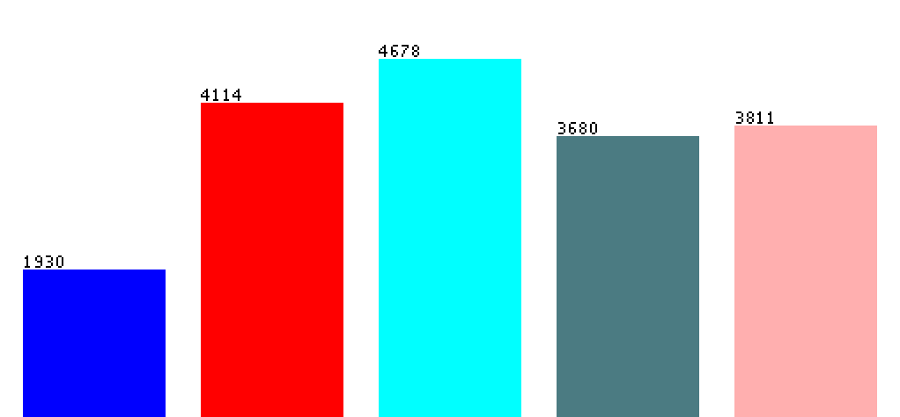

## The Motivation and the Goal
Music intrinsically is a part of everyone’s everyday life, whether they’re hyper-aware of it or not
at all. It comes up in all instances, varying from sounds in the park to going straight to the
source and listening to it intentionally. It pervades throughout our daily lives and as a result, it
tends to become an important part of society. It maintains value for its cultural meaning in
addition to how it individually provides meaning to some, whether one establishes a connection
in the lyrics or within the instrumentals. However, while there are many types of music out there,
not everyone listens to the same things. There might be some music out there that nearly no
one listens to out at all. As an extension of this, we beg to answer the question, what makes
music enjoyable to listen to? What properties make certain music enjoyable by the populous
and others not as enjoyable? Is there some music that can be defined as “the best?” Can we
figure out, if given a song, what will it mean to the people before it's even heard?

In this project, we aim to find a solution to this problem. Through analyzing various attributes of
a plethora of songs, we aim to determine what makes a song “the best.” In this instance, we will
define “best” by popularity. While music is obviously subjective, we aim to see if given the
properties of a song, if we can determine how well it would fare commercially, identifying the
common traits of the tunes that are currently considered popular and comparing any song that
may be made, observing if the properties of the song matches what’s currently trending. If we
are able to do this, we might be able to utilize such information to identify song traits necessary
to create commercial successes. This data can result in a lot of potential outcomes, ranging
from using it to make our own success through creating “better” songs, to understanding what’s
musically and culturally valued in our current society.

## The Dataset
To build our dataset, we first had to create a collection of songs because there currently isn’t a
way to pull random songs from the Spotify API. In order to accomplish this, we scraped the
website songfacts.com, which has a database of every song released sorted by year. So now we
have a list of songs and their respective artist from 2008 - 2018, with ~2000 songs per year for a
total of ~20,000 songs.

We are then able to work with the Spotify API to gather the statistics of each of these songs. The
Spotify API, given a song, can provide a wide range of attributes about the song itself. For the
purposes of this project, we are concerned with the following: duration, acousticness,
danceability, energy, instrumentalness, liveness, loudness, speechiness, valence, tempo, and
popularity. Spotify is able to provide numeric values for each of these attributes for each song (more 
information can be found at https://developer.spotify.com/documentation/web-api/reference/tracks/get-audio-features/).
With this, we plan to determine what traits are common in the most popular song and
understand what makes a song popular in our modern day culture.

## Solution
With songs and their traits in hand, we were able to generate our dataset and plug this into multiple 
learners to determine how each algorithm fared with our data. Our dataset ultimately included numeric 
inputs and resulted in a numeric output (a popularity value between 0 and 100). As sch, with these 
parameters, we tested using a decision tree, Gaussian Naive Bayes, K Nearest Neighbor, linear regression, and
logistic regression. 

## Testing and Training
10 CV Validation: We performed 10-fold cross validation to determine what is the best model to represent and classify our data. From our testing of the five models, the average test accuracy across the ten folds was 0.9996 for KNN, 0.9998 for Gaussian Naive Bayes, 0.2477 for linear regression, 0.9998 for decision tree, and 0.1378 for logistic regression. From these tests, we determined Gaussian Naive Bayes is the best model for our data.
Varying test set size: After deciding on the best model to classify our data, we wanted to determine the best split between the amount of testing and training data. We varied the test set size from 5% to 40% of the total data, testing the accuracy every 1%.

To test various models and determine what is the best model to represent and classify our data, we loaded our data into Weka and used 10-fold cross validation to test the models decision tree, K Nearest Neighbor, Naive Bayes, linear regression, and Multilayer Perceptron. We modified the attributes and classification as described below.

# Popularity
Since the popularity values are numeric and continuous and Weka takes categorical, discrete classifications, we divided the popularity values into five discrete groups. Level one songs had a popularity of 0 to 25, level two 25 to 35, level three 35 to 45, level four 45 to 60, and level five 60 and above. We chose this distribution because it seemed to produce a more even distribution across all groups. Level five has a wider range of popularity values than the other groups.

Figure 1: Popularity Distribution


## Results 

## Validation

## Final Report

## Team Contributions and Contact Information
Justin Chen - justinchen2020@u.northwestern.edu
- Learned how to use Spotify API to write Python script to connect Spotify API with Kenneth's web scraping code
- Contributed to discussion, viability, and usage of various machine learning algorithms for this project
- Created website

Kenneth Gomez - kennethgomez2020@u.northwestern.edu 
- Wrote Python script to web scrape songs for dataset and gathered dataset in the process
- Spearheaded discussion, viability, and usage of various machine learning algorithms for this project
- Created logistics for dataset training and testing

Leanna Hue - leannahue2020@u.northwestern.edu
- Wrote Python code to implement dataset with machine learning algorithms from Scikit-learn
- Generated graphs and final results using weka
- Contributed to discussion, viability, and usage of various machine learning algorithms for this project


## Welcome to GitHub Pages

You can use the [editor on GitHub](https://github.com/JustinFC/Culture-Clock/edit/master/README.md) to maintain and preview the content for your website in Markdown files.

Whenever you commit to this repository, GitHub Pages will run [Jekyll](https://jekyllrb.com/) to rebuild the pages in your site, from the content in your Markdown files.

### Markdown

Markdown is a lightweight and easy-to-use syntax for styling your writing. It includes conventions for

```markdown
Syntax highlighted code block

# Header 1
## Header 2
### Header 3

- Bulleted
- List

1. Numbered
2. List

**Bold** and _Italic_ and `Code` text

[Link](url) and 
```

For more details see [GitHub Flavored Markdown](https://guides.github.com/features/mastering-markdown/).

### Jekyll Themes

Your Pages site will use the layout and styles from the Jekyll theme you have selected in your [repository settings](https://github.com/JustinFC/Culture-Clock/settings). The name of this theme is saved in the Jekyll `_config.yml` configuration file.

### Support or Contact

Having trouble with Pages? Check out our [documentation](https://help.github.com/categories/github-pages-basics/) or [contact support](https://github.com/contact) and we’ll help you sort it out.
