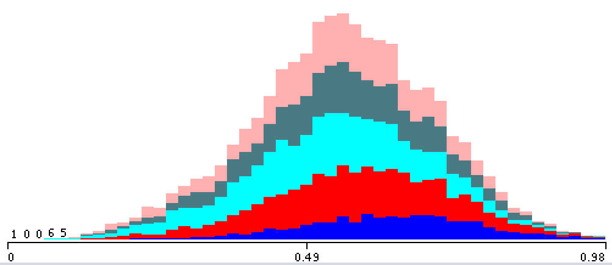

## The Motivation and the Goal
Music intrinsically is a part of everyone’s everyday life, whether they’re hyper-aware of it or not
at all. It comes up in all instances, varying from sounds in the park to going straight to the
source and listening to it intentionally. It pervades throughout our daily lives and as a result, it
tends to become an important part of society. It maintains value for its cultural meaning in
addition to how it individually provides meaning to some, whether one establishes a connection
in the lyrics or within the instrumentals. However, while there are many types of music out there,
not everyone listens to the same things. There might be some music out there that nearly no
one listens to out at all. As an extension of this, we beg to answer the question, what makes
music enjoyable to listen to? What properties make certain music enjoyable by the populous
and others not as enjoyable? Is there some music that can be defined as “the best?” Can we
figure out, if given a song, what will it mean to the people before it's even heard?

In this project, we aim to find a solution to this problem. Through analyzing various attributes of
a plethora of songs, we aim to determine what makes a song “the best.” In this instance, we will
define “best” by popularity. While music is obviously subjective, we aim to see if given the
properties of a song, if we can determine how well it would fare commercially, identifying the
common traits of the tunes that are currently considered popular and comparing any song that
may be made, observing if the properties of the song matches what’s currently trending. If we
are able to do this, we might be able to utilize such information to identify song traits necessary
to create commercial successes. This data can result in a lot of potential outcomes, ranging
from using it to make our own success through creating “better” songs, to understanding what’s
musically and culturally valued in our current society.

## The Dataset
To build our dataset, we first had to create a collection of songs because there currently isn’t a
way to pull random songs from the Spotify API. In order to accomplish this, we scraped the
website songfacts.com, which has a database of every song released sorted by year. So now we
have a list of songs and their respective artist from 2008 - 2018, with ~2000 songs per year for a
total of ~20,000 songs.

We are then able to work with the Spotify API to gather the statistics of each of these songs. The
Spotify API, given a song, can provide a wide range of attributes about the song itself. For the
purposes of this project, we are concerned with the following: duration, acousticness,
danceability, energy, instrumentalness, liveness, loudness, speechiness, valence, tempo, and
popularity. Spotify is able to provide numeric values for each of these attributes for each song (more 
information can be found at https://developer.spotify.com/documentation/web-api/reference/tracks/get-audio-features/).
With this, we plan to determine what traits are common in the most popular song and
understand what makes a song popular in our modern day culture.

## Solution
With songs and their traits in hand, we were able to generate our dataset and plug this into multiple 
learners to determine how each algorithm fared with our data. Our dataset ultimately included numeric 
inputs and resulted in a numeric output (a popularity value between 0 and 100). As sch, with these 
parameters, we tested using a decision tree, Gaussian Naive Bayes, K Nearest Neighbor, linear regression, and
logistic regression. 

## Testing and Training
To test various models and determine what is the best model to represent and classify our data, we loaded our data into Weka and used 10-fold cross validation to test the models decision tree, K Nearest Neighbor, Naive Bayes, linear regression, and Multilayer Perceptron. For each attribute, we modified the values and studied the distribution for the normal attribute values, the square of the values, and the natural log of the values. We wanted to choose the modification of the attribute values that would be most descriptive and have a higher impact on the resulting classification. As a result, for our final tests we chose values where the distribution was close to normal or even. The chosen modification of the attributes and classification are shown and described in the figures below.

### Popularity
Since the popularity values are numeric and continuous and Weka takes categorical, discrete classifications, we divided the popularity values into five discrete groups. Level one songs had a popularity of 0 to 25, level two 25 to 35, level three 35 to 45, level four 45 to 60, and level five 60 and above. We chose this distribution because it seemed to produce a more even distribution across all groups. Level five has a wider range of popularity values than the other groups because there are less songs that have a popularity of 60 and above.

Figure 1: Popularity Distribution 

### Danceability
For the danceability attribute, we used the unmodified values since its distribution was the closest to a normal distribution. 

Figure 2: Distribution of Danceability Values (unmodified)

.png)
Figure 3: Distribution of Danceability Values (natural log)


Figure 4: Distribution of Danceability Values (squared)

### Energy 
We used the square of the original values for the energy attribute since they were the closest to an even distribution. 

Figure 5: Distribution of Energy Values (unmodified)

.png)
Figure 6: Distribution of Energy Values (natural log)


Figure 7: Distribution of Energy Values (squared)

### Speechiness 
We used the natural log of the original values for the speechiness attribute since they had the widest range of values. 

Figure 8: Distribution of Speechiness Values (unmodified)

.png)
Figure 9: Distribution of Speechiness Values (natural log)


Figure 10: Distribution of Speechiness Values (squared)

### Loudness 
For the loudness attribute, we used the natural log of the original values since they were the closest to a normal distribution. 

Figure 11: Distribution of Loudness Values (unmodified)

.png)
Figure 12: Distribution of Loudness Values (natural log)


Figure 13: Distribution of Loudness Values (squared)


### Acousticness 
For the acousticness attribute, we used the natural log of the original values since they had the widest range of values. 

Figure 14: Distribution of Acousticness Values (unmodified)

.png)
Figure 15: Distribution of Acousticness Values (natural log)


Figure 16: Distribution of Acousticness Values (squared)

### Liveliness
We used the natural log of the original values for the liveliness attribute since they had the widest range of values. 

Figure 17: Distribution of Liveliness Values (unmodified)

.png)
Figure 18: Distribution of Liveliness Values (natural log)


Figure 19: Distribution of Liveliness Values (squared)

### Valence
We used the original values for the valence attribute since its distribution was the closest to normal. 

Figure 20: Distribution of Valence Values (unmodified)

.png)
Figure 21: Distribution of Valence Values (natural log)


Figure 22: Distribution of Valence Values (squared)

### Tempo 
We used the original values for the tempo attribute since its distribution was the closest to normal and had the widest range of values. 

Figure 23: Distribution of Tempo Values (unmodified)

.png)
Figure 24: Distribution of Tempo Values (natural log)


Figure 25: Distribution of Tempo Values (squared)

### Year 
We used the original values for the year attribute since its distribution did not change when we modified the values. 

Figure 26: Distribution of Year Values (unmodified)

.png)
Figure 27: Distribution of Year Values (natural log)


Figure 28: Distribution of Year Values (squared)

### Instrumentalness, Duration, and Time Signature
We decided not to use the attributes instrumentalness, duration, and time signature because they did not have a normal or even distribution for any of the modifications, and we did not think these attributes contributed to the classification of the songs.

Figure 29: Distribution of Instrumentalness Values (unmodified)

.png)
Figure 30: Distribution of Instrumentalness Values (natural log)


Figure 31: Distribution of Instrumentalness Values (squared)


Figure 32: Distribution of Duration Values (unmodified)

.png)
Figure 33: Distribution of Duration Values (natural log)


Figure 34: Distribution of Duration Values (squared)


Figure 35: Distribution of Time Signature Values (unmodified)

.png)
Figure 36: Distribution of Time Signature Values (natural log)


Figure 37: Distribution of Time Signature Values (squared)

## Results 
We used 10-fold CV to evaluate our models. We compared the accuracy using various algorithms and the results are summarized below:


Figure 38: Cross Validation results

Surprisingly, the accuracy of our models decreased when we applied these transformations. The poor results in general aren’t too surprising. When you look at the distributions of all the attributes versus the popularity classifications, none of the attributes have a significant split. In each of the attributes, there’s an even amount of each kind of song across the range of values. This implies that there really isn’t a strong relationship between the attributes we selected and the popularity of the song, unfortunately. There are probably other factors in play. For example, if I release a song with a certain set of attributes, and Drake releases one with the identical set, Drake’s is definitely still going to be much more popular. This is because the popularity of the artist is a huge factor, and one that would have certainly helped this dataset.


Besides simply transforming the individual attributes, we also tried kernel methods to further distinguish bad songs from good songs. The kernel classifier we found on Weka implemented kernel functions with logistic regression, however it only worked for binary attributes. We split the data in half, the bottom half representing unpopular songs and the upper half representing popular songs. We had to reduce the size of our dataset to 10,000 because Weka would crash if we put anymore. The results of this algorithm with 10-fold CV was 65.83%. This seemed really promising at first, but ZeroR was 63%, which means the model wasn’t accomplishing much. So, our conclusion remains the same.


## Final Report

## Team Contributions and Contact Information
Justin Chen - justinchen2020@u.northwestern.edu
- Learned how to use Spotify API to write Python script to connect Spotify API with Kenneth's web scraping code
- Contributed to discussion, viability, and usage of various machine learning algorithms for this project
- Created website

Kenneth Gomez - kennethgomez2020@u.northwestern.edu 
- Wrote Python script to web scrape songs for dataset and gathered dataset in the process
- Spearheaded discussion, viability, and usage of various machine learning algorithms for this project
- Created logistics for dataset training and testing

Leanna Hue - leannahue2020@u.northwestern.edu
- Wrote Python code to implement dataset with machine learning algorithms from Scikit-learn
- Generated graphs and final results using weka
- Contributed to discussion, viability, and usage of various machine learning algorithms for this project


## Welcome to GitHub Pages

You can use the [editor on GitHub](https://github.com/JustinFC/Culture-Clock/edit/master/README.md) to maintain and preview the content for your website in Markdown files.

Whenever you commit to this repository, GitHub Pages will run [Jekyll](https://jekyllrb.com/) to rebuild the pages in your site, from the content in your Markdown files.

### Markdown

Markdown is a lightweight and easy-to-use syntax for styling your writing. It includes conventions for

```markdown
Syntax highlighted code block

# Header 1
## Header 2
### Header 3

- Bulleted
- List

1. Numbered
2. List

**Bold** and _Italic_ and `Code` text

[Link](url) and 
```

For more details see [GitHub Flavored Markdown](https://guides.github.com/features/mastering-markdown/).

### Jekyll Themes

Your Pages site will use the layout and styles from the Jekyll theme you have selected in your [repository settings](https://github.com/JustinFC/Culture-Clock/settings). The name of this theme is saved in the Jekyll `_config.yml` configuration file.

### Support or Contact

Having trouble with Pages? Check out our [documentation](https://help.github.com/categories/github-pages-basics/) or [contact support](https://github.com/contact) and we’ll help you sort it out.
